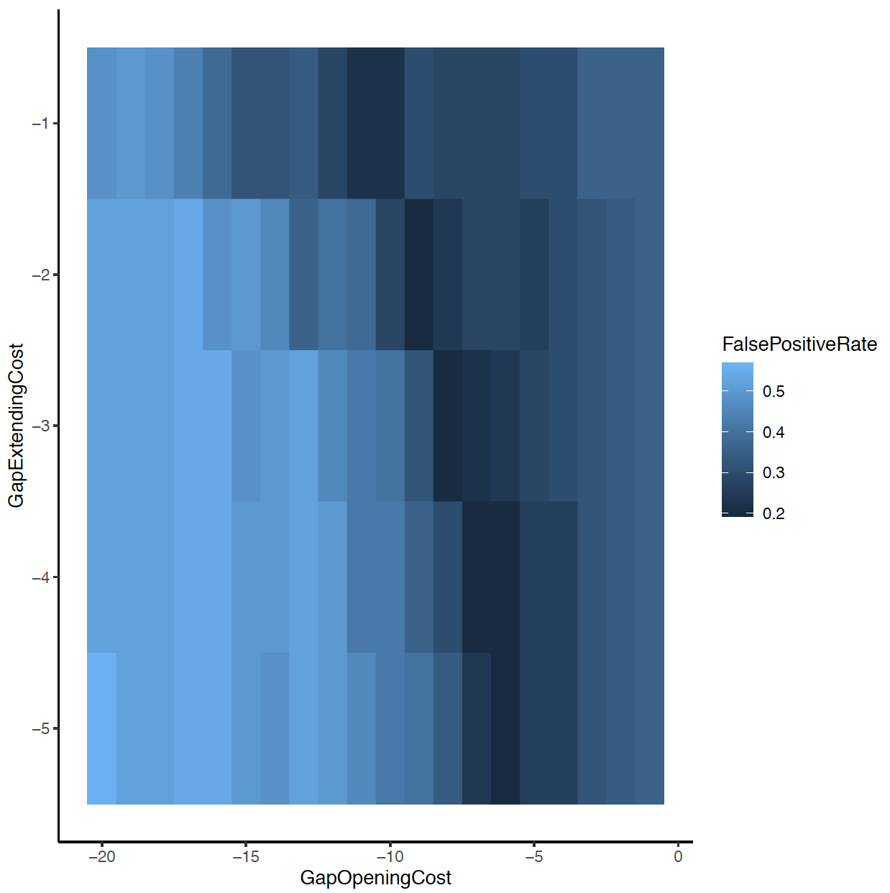
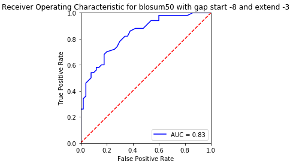
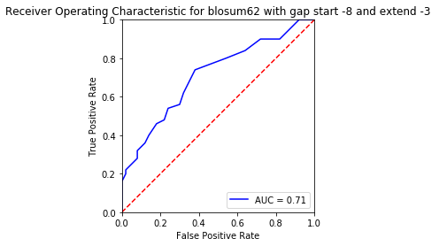
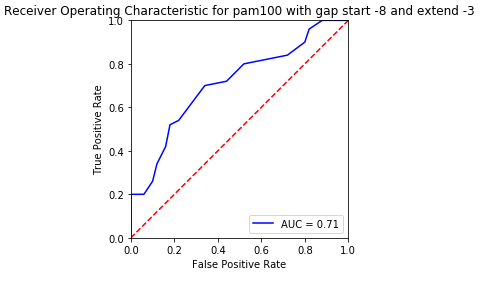
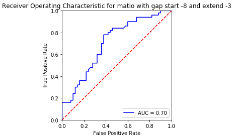
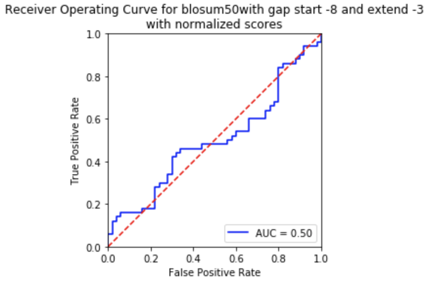

# Write Up Homework 3: Smith-Waterman

[](https://travis-ci.org/cechlauren/HW3_skeleton)

Smith-Waterman-derived alignment project with testing.

## USAGE

To use the package, first make a new conda environment and activate it

```
conda create -n exampleenv python=3
source activate exampleenv
```

then run

```
conda install --yes --file requirements.txt
```

to install all the dependencies in `requirements.txt`. Then the package's
main function (located in `HW3_skeleton/hw3align/__main__.py`) can be run as follows

```
python -m smith_waterman
```

## TESTING

Testing is as simple as running

```
python -m pytest
```

from the root directory of this project.

## Questions Part 1

### Question 1
Consider the false positive rate (proportion of negative pairs with scores that exceed
a score threshold) when the true positive rate (proportion of positive pairs with scores
above the threshold) is 0.7. 
-What's the best false positive rate that you can achieve with varying both gap opening (from 1 to 20) and extension penalties (from 1 to 5) with the BLOSUM50 matrix? 
-What is the best gap penalty combination?

The best (read lowest) false positive rate I could achieve was 20% when varying gap opening/extension given a true positive rate of 70%.  This is shown in [optimalgaps.py](https://github.com/cechlauren/HW3_skeleton/blob/master/hw3align/optimalgaps.py).
R was used to plot this data (a table of values fpr values for each combinatino of gap opening/extension), which can be found in [gapPenalties.txt](https://github.com/cechlauren/HW3_skeleton/blob/master/hw3align/gapPenalities.txt), to find the optimal combination of gap penalties. 
Here is the R script: [OptimizeGapsRscript.txt](https://github.com/cechlauren/HW3_skeleton/blob/master/OptimizeGapsRscript.txt).

We determine all true positive alignment scores to find the cutoff that sets true positive rate at 70%; they range from roughly 35-250.
The FPR will then be the count of neg. scores above the cutoff we designated, divided by the number of true negatives. This is all described in [optimalgaps.py](https://github.com/cechlauren/HW3_skeleton/blob/master/hw3align/optimalgaps.py).

So, using those cutoffs, we get the following false positive rate distribution:
<br />
If you see nothing, also see: [optimizeGapPenalitiesPlot.pdf](https://github.com/cechlauren/HW3_skeleton/blob/master/optimizeGapPenalitiesPlot.pdf)

I found several combinations [lowestFPR.png](https://github.com/cechlauren/HW3_skeleton/blob/master/lowestFPR.png) that result in a 20% FPR, but decided to go with the less extreme case where

Gap opening: -8
Gap extension: -3


The following analyses will use the above affine penalties.

### Question 2
-Using the gap penalties you determined from question 1, which of the provided
scoring matrices performs the best, in terms of false positive rate (at a true positive rate
of 0.7)? 
-What are the performance rates of each of the matrices? 

To identify the best scoring matrix based on the best affine penalities I identified in question 1 I calculated and plotted the respective scores using [roc.py](https://github.com/cechlauren/HW3_skeleton/blob/master/hw3align/roc.py). 
All plots can be viewed in this directory: [ROCplots](https://github.com/cechlauren/HW3_skeleton/tree/master/ROCplots).
The following are the unnormalized ROC for each scoring matrix:

<br />

<br />

<br />

<br />

<br />

So, in summary, the false positive rates for each matrix at a 70% true positive rate are:
- **BLOSUM50: 20%**
- BLOSUM62: 40%
- PAM100: 30%
- PAM250: 25%
- MATIO: 35%

The BLOSUM50 and PAM250 matrices have the same AUC, but the false positive rate for BLOSUM50 is superior at the TPR designated in this assignment. Unexpectedly, the MATIO did not perform worst overall...but does have the lowest initial TPR.

### Question 3

-How does the performance change if you normalize the Smith-Waterman scores by
the length of the shortest sequence in a pair (i.e. divide the raw score by the min
length)? Show the ROC curves for your best matrix and for the same matrix with
normalized scores. 
-Are the false positive rates better or worse? 
-Why do you think this is so?

To be frank, these normalized ROCs look terrible. 
Here is the best matrix non-normalized:
<br />

And here it is normalized (see code: [roc.py](https://github.com/cechlauren/HW3_skeleton/blob/master/hw3align/roc.py) ) by the shortest sequence length of a pair:

<br />

Reporting the FPR at 70% TP level:
- **BLOSUM50: 80%**
- BLOSUM62: 90%
- PAM100: 83%
- **PAM250: 75%**
- MATIO: 85%

Although these FPR are distinctly worse, it is encouraging to see that BLOSUM50 still performs well relative to the others under normalized conditions.  PAM250 also performs well. Both have the same AUC. See directory [ROCplots](https://github.com/cechlauren/HW3_skeleton/tree/master/ROCplots) for normalized plots.

These worsened scores displayed by the normalized plots indicate that normalization likely impairs the SW function's ability to distinguish between the pairs designated as positives and negatives. I'm guessing if you were to compare non-normalized to normalized scores distributions, the extent of distributions would be closer in normalized conditions.
Given how normalizing to the smallest sequence affected the FPR, I might hypothesize that the SW function works better at finding a local match when the two sequences are longer (esp if the positive pairs set has longer sequences). Maybe we could try training with datasets that have similar distributions of sequence lengths to confirm this?

## Questions Part 2

## Question 1

-Using the best gap penalties and matrix from part 1, create an alignment for each positive pair of sequences and each negative pair of sequences. You will use these static alignments as a starting point from which to optimize a scoring matrix to maximize separation of scores of the positive and negative pairs.

-Devise an optimization algorithm to modify the values in a starting score matrix such as to maximize the following objective function: sum of TP rates for FP rates of 0.0, 0.1, 0.2, and 0.3. The maximum value for the objective function is 4.0 (where you are getting perfect separation of positive and negative pairs even at the lowest false positive rate).

I'll proceed with the BLOSUM50 matrix because of its better initial FPR in the non-normalized instance. 
To see how the objective function was maximized: [optimalmatrix.py](https://github.com/cechlauren/HW3_skeleton/blob/master/hw3align/optimalmatrix.py) and look for "optimizeMatrix_geneticAlg".

The function works by optimizing an alignment score matrix with a genetic algorithm. The function will stop if it hits a certain number of iterations (a parameter we can put in), or if it doesn't see a new objective function value in the top of the library where we track the best scoring matrices to repopulate with in a certain number of steps without improvement. The function returns a final population of matrices, the scores for matrices at the last step taken, the library of best matrices, and a list of the mean objective function value at each step taken. 


